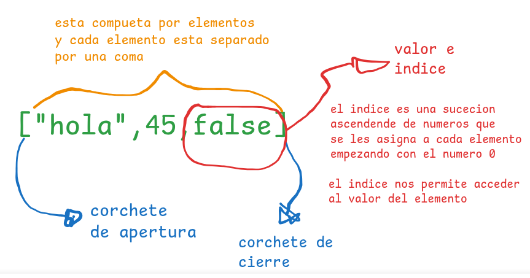

# TALLER DE REPASO DE JAVASCRIPT
> [!WARNING] Observacion: 
> Quokka se debe ejecutar en cada archivo

> [!TIP] 
> Quokka detecta que en nuestro proyecto tenemos `node.js` y lo ejecuta para poder ver la consola en vivo 
## 1. TIPOS DE DATOS
Es la manera de como capturamos la informacion
> [!NOTE]
> Javascript tiene funcione predeterinadas
para mostrar un mensaje por consola `console.log()`, para poder verficar que tipo de dato estamos manejando en javaescript tambien tenemos una funcion por defecto llamada `typeof()`

Se clasifica en 2 grupos:
>### PRIMITIVOS
son datos que siempre existen

**Numericos**
- Enteros positivos
- Enteros negativos
- Decimal positivo
- Decimal negativo
- NaN (Not and Number)

**Textos**
- Caracteres
- Caracteres especiales
- String

**Booleanos**
- True => 1
- False => 0
>### ESTRUCTURADOS
**Array (lista)**
- array de tipo numerico
- array de tipo string
- array de tipo mixto

Como esta estructurado un array en javascript

**Objetos (diccionario):** Son similares a las listas con la unica diferencia que envez de tener valor e indice sus elementos trabajan con clave y valor.

## 2. VARIABLES (ENLACES, BINDING)
Es la tecnica que se usa para apuntar en dirreccion en memoria y al valor o dato relacional o que ese encuentre almacenado en ese momento.

Tenemos dos pasos pra declarar una varibales:
1. Primero declarar la variable/constante
2. Segundo inicializar la variable/constante
> [!Note]
> Para crear una variable primero tenemos que crear el enlace y luego darle el nombre de la variable/constante

> [!Tip] Recomendación
> - `let:` Usar cuando el valor tendra que variar
> - `const:` Usar cuando el valor sera el mismo siempre
> - `var:` evitar usar
> - `let` `var:` Ambos nos permiten crear variables, su unica diferencia es el alcance ambito o `scope` (averiguar)

## 3. OPERADORES
**Su clasificacion general de divide en tres:**
> ### Operadores unarios
Son aquellos que tiene el operador a la izquierda del valor y que retorna un unico valor
- operador de negacion
> ### Operadores binarios
Son aquellos que estan en medio de dos valores y que retorna un unico valor
- operadores aritmeticos
- operadores de comparacion
- operadores logicos
> ### Operadores ternarios
Son aquellos que evaluan tres valores y retornan un solo valor
- operador condicional
## 4. CONTROLES DE FLUJO
> [!NOTE]
> Nuestros programas en javascript contienen mas de una sentencia y las sentencias son ejecutadas una a una como si fuera una historia, de arriba hacia abajo como un camino recto.

>### Control de decision (if-else)
Javascript nos permite crear caminos alternativos en nuestros programas dependiendo de una decision, a esto se le conoce como caminos o ejecucion condicional, que ejecutara una sentencia u otra teniendo encuenta la condicion asi podemos crear multiples caminos u opciones en nuestro programa.
Si tenemos una decision verdadera se ejecutara una sentencia, si tenemos una codicion falsa se ejecutara otra sentencia totalmente distinta.
> [!TIP]
> La ejecución condiiconal rompe el flujo normal de un programa

>### Bucles (for) - (tarea)
>### Bucles (while) (tarea)
## 5. FUNCIONES
## 6. MÉTODOS PARA TRABAJAR CON DATOS ESTRUCTURADOS (tarea)
## 7. DOM
### Métodos para Arrays
Son una forma común de almacenar datos estructurados como listas
- `map():` Crea un nuevo array aplicando una funcion a cada elemento.
- `filter():` Crea un nuevo array con los elementos que cumpla una función
- `reduce():` Reduce los elementos a un solo valor
- `find():` Retorna el primer elemento que cumpla una condición
- `some():` Devuelve `True` si al menos uno cumple una condición
- `every():` Devuelve `True` si todos cumplen la condición
- `flat():` Aplana arrays anidados
- `sort():` Ordena los elementos
### Métodos para objetos
Los objetos permite estructurar información como pares clave/valor
- `object.keys():` Devuelve un array con las claves
- `object.values():` Devuelve un array con las valores
- `object.estries():` Devuelve un array de pares `[clave, valor]`
- `object.assing():` Copia propiedades de uno o más objetos a otro
- `hasOwnProperty:` Verifica si una propiedad existe